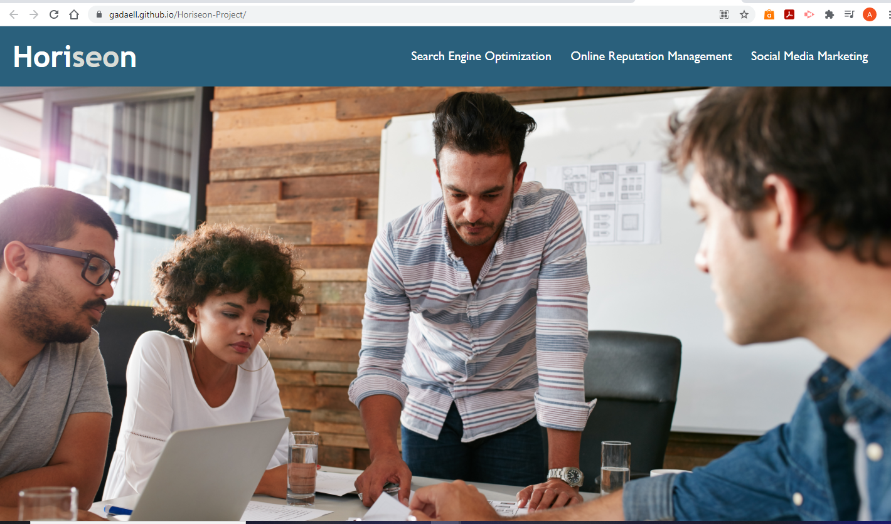

# Horiseon-Project../

## Purpose: 
Horiseon is to help an upcoming business get themselves elevated off the ground. Horiseon provides 3 services that would help get your business off the ground. With Horiseon's assistance, you will realize it will help with Brand Awareness, Cost Management, and lead generation to your business. 

## Challenge I Faced:
When I was buidling the Brand Awareness, Cost Management, and Lead Generation icons, I was not able to fit them with the margin of the outline. After changing the classes on each section and applying the new rules into the CSS file. I was able to make it fit in that section. 

## Built with:
* HTML
* CSS

## Website
https://gadaell.github.io/Horiseon-Project/

## Contribution
Made by A'Darius (A'D) Ellis

### © 2019 Horiseon Social Solution Services, Inc.